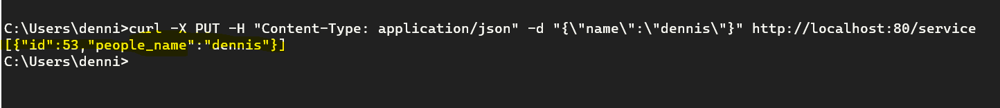
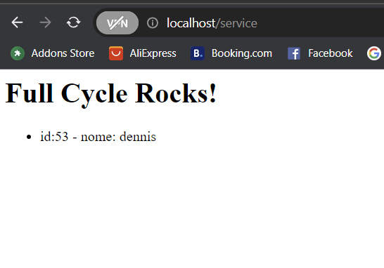

# fullcycle-nginx-docker

Desafio de projeto docker para criar uma imagem utilizando Nginx e Node

# COMANDOS

- Build da Imagem com Dockerfile especifico:
sudo docker build . -t fullcycle-node -f ./Dockerfile.node 
sudo docker build . -t fullcycle-nginx -f ./Dockerfile.nginx
sudo docker build . -t fullcycle-postgres -f ./Dockerfile.postgres

- Criar uma network
docker network create fullcycle

- Executar container
sudo docker run --name node --network fullcycle -d -p 3000:3000 fullcycle-node 
sudo docker run --name nginx --network fullcycle -d -p 8080:80 fullcycle-nginx
sudo docker run --name postgres --network fullcycle -d -p 5432:5432 fullcycle-postgres

-Acessar base de dados
docker exec -it postgres bash
psql -U pg -d database
SELECT * FROM people;

-Exibir logs do container
docker logs <ID ou nome-do-container>


# DESAFIO

- Acessar o NodeJs pelo Nginx como proxy reverso passando um nome no body da requisição que será salvo na base de dados e retornado quando acessar pelo browser

1 - Enviar a seguinte request com o método PUT e no body passar o atributo name:



```json
curl -X PUT -H "Content-Type: application/json" -d "{\"name\":\"SEU_NOME\"}" http://localhost:80/service
```


2 - Acessar a url pelo browser:



http://localhost:80/service

```json
http://localhost:80/service
```

3 - Acesso via cURL:

```json
curl -i http://localhost:80/service
```
